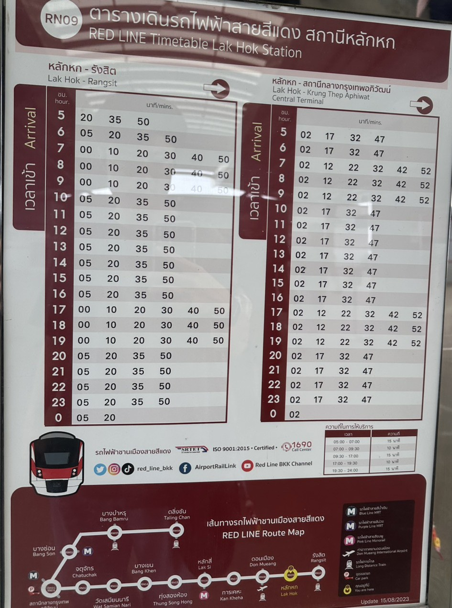

# SRT Red Line – Lak Hok Station API

Free, open timetable API for the SRT Red Line commuter rail at **Lak Hok Station (RN09)**, Bangkok, Thailand.

> Data source: official station timetable poster (updated 15/08/2023).



---

## Endpoints

| Method | Endpoint | Description |
|--------|----------|-------------|
| GET | `/` | API info and available endpoints |
| GET | `/directions` | List all direction keys |
| GET | `/timetable` | Full timetable for both directions |
| GET | `/timetable/{direction}` | Schedule for one direction |
| GET | `/departures?direction=...` | Flat sorted list of departure times |
| GET | `/next?direction=...&time=HH:MM` | Next departure (defaults to Bangkok time now) |

**Direction keys:**
- `lak_hok_to_rangsit`
- `lak_hok_to_krung_thep_aphiwat`

Interactive docs available at `/docs` (Swagger UI) and `/redoc`.

---

## Quick Start

```bash
# 1. Clone and enter the project
git clone https://github.com/YOUR_USERNAME/redline-api.git
cd redline-api

# 2. Create and activate a virtual environment
python -m venv .venv
.venv\Scripts\activate        # Windows
# source .venv/bin/activate   # macOS / Linux

# 3. Install dependencies
pip install -r requirements.txt

# 4. Run the development server
uvicorn api.index:app --reload
```

Open **http://127.0.0.1:8000/docs** to explore the API.

---

## Example Requests

```bash
# Next train to Rangsit right now (Bangkok time)
curl "http://localhost:8000/next?direction=lak_hok_to_rangsit"

# Next train after 08:30
curl "http://localhost:8000/next?direction=lak_hok_to_krung_thep_aphiwat&time=08:30"

# All departures to Rangsit
curl "http://localhost:8000/departures?direction=lak_hok_to_rangsit"

# Full timetable
curl "http://localhost:8000/timetable"
```

You can also use `test.http` with the [REST Client](https://marketplace.visualstudio.com/items?itemName=humao.rest-client) VS Code extension to run requests directly from the editor.

---

## Project Structure

```
redline-api/
├── api/
│   └── index.py          # FastAPI app
├── data/
│   └── timetable.json    # timetable data
├── docs/
│   └── S__2736135.jpg    # timetable poster photo
├── requirements.txt
├── test.http             # sample requests (REST Client extension)
```

---

## License

MIT
